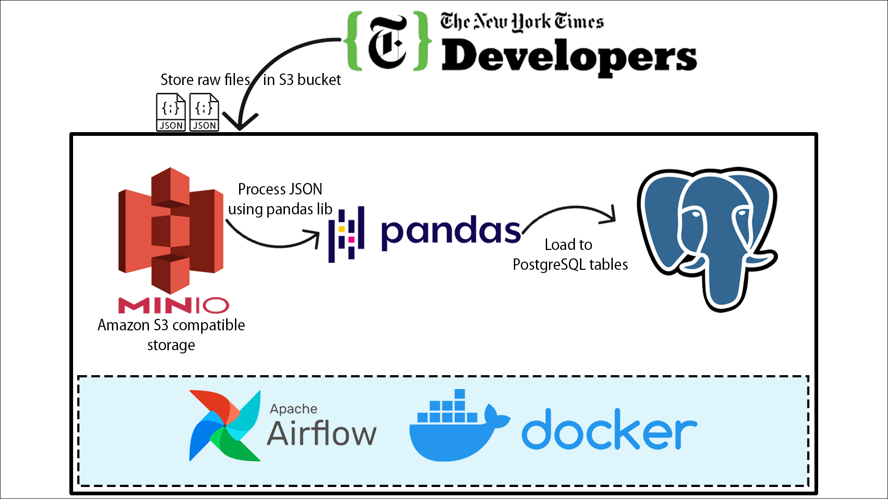

# New York Times Movie Reviews API Pull

DAG to extract Movie Reviews from the New York Times API and insert them into a PostgreSQL database.

To sign-up for a developer account, register an application, and generate API Keys, refer to the developer site: https://developer.nytimes.com

## Architecture Diagram

### Technologies

- **Airflow**: Pipeline Orchestration
- **Amazon S3 (MinIO)**: Data Lake
- **Docker,** **Docker Commpose**: Containerization
- **PostgreSQL**: Data Warehouse
- **Python Pandas**: Data Transformation
- **SQL**: Data Analysis & Exploration

## ETL Flow

