# Salesforce Marketing Cloud (SFMC)
## Table of Contents
1. [Overview](#overview)
2. [Contacts](#contacts)
3. [Program and Background Information](#program-and-background-information)
4. [Data Acquisition](#data-acquisition)
5. [Integration Process](#integration-process)
   - [Source to S3 Bucket](#source-to-s3-bucket)
   - [S3 Bucket to GCP](#s3-bucket-to-gcp)
   - [Process Flow Diagram](#process-flow-diagram)
6. [References](#references)

## Overview

Marketing Cloud is a customer relationship platform that is being used by Optumlabs mostly for digital marketing automation.
The data being acquired from Marketing Cloud, called Tracking Extracts, provide granular data regarding several aspects
of email send jobs such as clicks, bounces, and survey data.

The actual extraction of the data is
scheduled within the Marketing Cloud application via the _Journey Builder > Automation Studio_. The application returns tracking extract data in a zipped file. The size of that file can vary depending on the amount of activity, the accounts involved, and the types of data requested. 

**Business Unit Configuration**

The following shows OptumLabs’ Marketing Cloud business unit configuration:
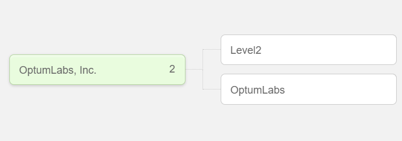

Anything related to Level2 program are housed in the Level2 business unit whose data are closely related to the program’s corresponding Salesforce CRM instance Salesforce Legacy. Other smaller pilots, on the other hand, are housed in the UHGRD Pilots business unit whose data are closely related the Salesforce CRM instance Salesforce Zeus. 

**Account IDs**

The following IDs appear in records based on the business unit the data was extracted from:

|Business Unit||
|---|---|
|Enterprise|100041759|
|Level 2|515001017|
|UHGRD Pilots|515006187|

## Contacts
|Resource|Email|Role|
|---|---|---|
|Rodney Cortes|rcortes@savvysherpa.com|Data Owner or Consumer|
|Tito Culibra|tculibra@savvysherpa.com|Partner Contact|
|Ken Bryce Tagimacruz|ktagimacruz@savvysherpa.com|Partner Contact|
|Edson Paul Semorio|esemorio@savvysherpa.com|PH Data Engineer (Primary)|
|Justin Evan Mancao|jemancao@savvysherpa.com|PH Data Engineer (Secondary)|

## Program and Background Information
|Details| |
|---|---|
|Is this part of a Pilot?|Yes|
|Is data for UHC Members or general population?|Data comprises of commercial and general population.|
|Area of focus if known (EMR, claims, CRM, etc.)?|CRM, Email|
|Is there demographic information?|Yes, based on Salesforce Legacy and Zeus MDM Crosswalks|

## Data Acquisition
|Details||
|---|---|
|Data: <ul><ul><li>Inbound</li><li> Outbound</li></ul></ul> | Inbound |
|Frequency: <ul><ul><li>One time</li> <li>Recurring (Hourly, Daily, Weekly, Monthly, etc.)</li><li> Custom</li></ul></ul>| Daily |
|Data location: <ul><ul><li>Within UHG</li><li> External partner</li></ul></ul> | External partner |
|Data source: <ul><ul><li>Database (Azure, AWS, PostgreSQL, etc.)</li><li> Streaming (Pubsub, Kafka, etc.)</li><li> Files (NGIS, GCS, etc.)</li><li> API | API|

## Integration Process
|Details||
|---|---|
|Dag Name|salesforce_marketing_cloud_s3_to_final|
|Schedule|Daily at 14:00:00 UTC|
|Data Extract Schedule|<ul><li>Enterprise Level: 1:00 a.m. CT</li><li>Level2: 12:30 a.m. CT</li><li>OptumLabs Pilots: 1:30 a.m. CT</li></ul>|
|Refresh flow|Incremental|
|MDM table creation|Yes|
|Checking/ monitoring|Airflow|
|Number of files, expected file size|43 Files|
|Data Transformation|File to table|

### Source to S3 Bucket
This provides details on how the actual extraction of data is set-up in Marketing Cloud until the delivery of all the CSV files contained in zipped files to ECG inbound location. 

These are the connection details related to creating an automation via _Journey Builder > Automation Studio_ within Marketing Cloud. 

|Details||
|---|---|
|SFMC Application|https://mc.exacttarget.com/cloud|
|SFMC Username|EdsonSemorioUHG|
|SFMC Password|*****|
|ECG SFTP Inbound Request#|21DV3|
|ECG Inbound Directory|/in/SalesForceMarketing/urd|
|ECG UserID|es10f80|

#### Setting-up File Location

This refers to the location where the data extracts will be sent.

In Marketing Cloud, navigate to _Settings > Setup_. Under _Administration_, go to _Data Management_ and select _File Location_.
Click _Create_ and enter the necessary information. Under _Location Type_, choose _External SFTP Site_.  
Under _url_, enter the ECG Inbound Directory.

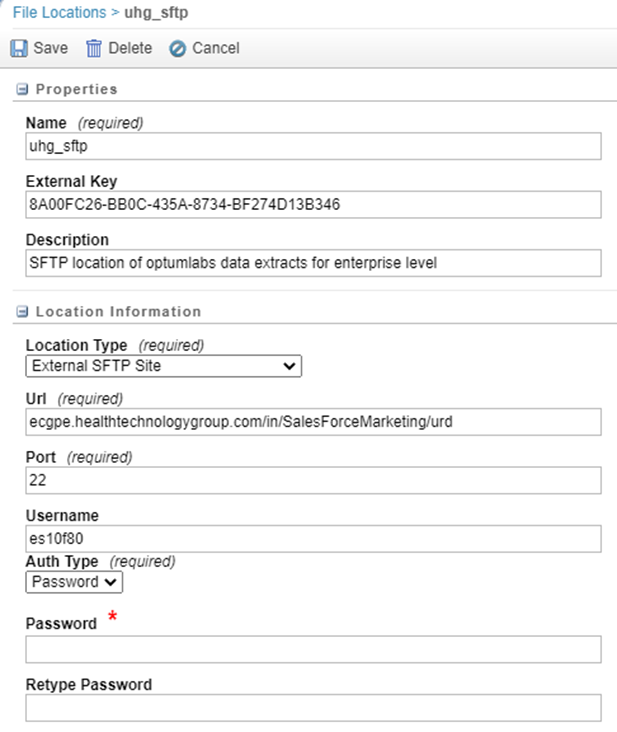

#### Creating the Data Extract Automation

This provides details on how to automate a data extract activity within Marketing Cloud.  

Hover the mouse cursor in the top left corner with the word Setup beside the Marketing Cloud logo.
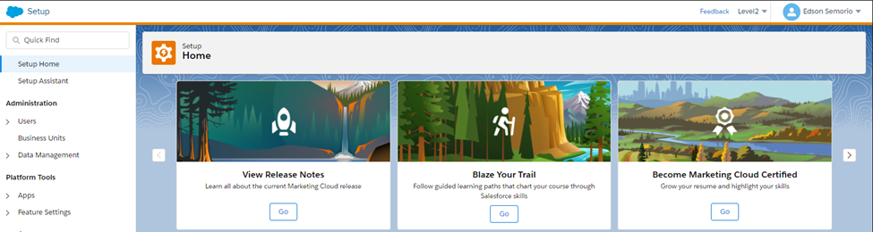

This will reveal the rest of the main menus in Marketing Cloud. 
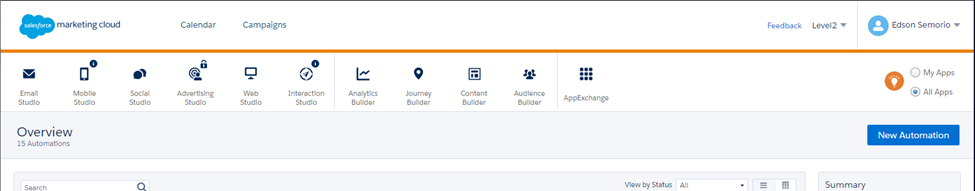

Next, hover the mouse cursor to _Journey Builder_ and select _Automation Studio_. 

The _Automation Studio_ data extract activity creates one or more zipped files for your use outside the Marketing Cloud application. For full details on Data Extract Activity, refer to this link from the official Marketing Cloud documentation: https://help.salesforce.com/articleView?id=sf.mc_as_use_a_data_extract_activity.htm&type=5  

Inside _Automation Studio_, click _New Automation_. At this point, the data extract automation will show a Workflow that consists three elements: 1) _Schedule_, 2) _Data Extract activity_, 3) _File Transfer activity_. 
<ul>
   <li><b><i>Schedule</i></b> 
   To create a schedule, just drag and drop the Schedule icon on to the Starting Source column and click Configure. Upon clicking, the screen below will that allows for setting-up the starting time of the automation and the frequency at which to run it. 
   </li>
   
   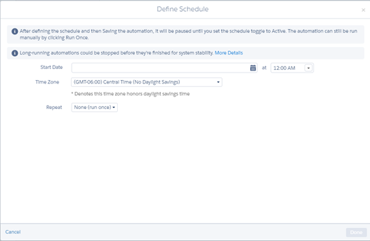
   <li><b><i>Data Extract Activity</i></b> 
   Drag the Data Extract icon on to the canvas beside the Starting Source. This is the actual extraction of several types of data related to an email send in Email Studio.

   Click Choose and click Create New Data Extract Activity in the next screen. This will present the configurations needed to create a Data Extract. Note that the Data Extract needs to be setup as a Tracking Extract in order to allow for the extraction of the key entities.  
   </li>

   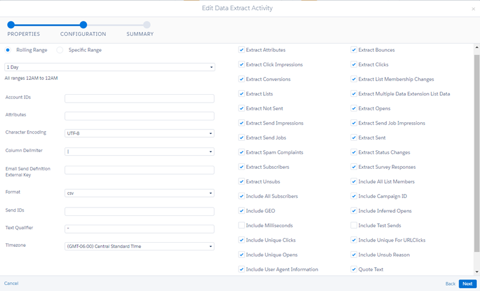
   <li><b><i>File Transfer Activity</i></b> 
   One thing to note is during the Data Extract Activity, the actual extracted files are first placed in Marketing Cloud’s secure storage location called Safehouse.
   To make it available for us, a File Transfer Activity needs to be created going to the External SFTP Site Location we first setup.  
   
   Drag the File Transfer icon to the canvas. This will create a Step 2 column. Click Choose and click Create New File Transfer Activity. In the next window, under File Action, choose Move a File From Safehouse. 
   
   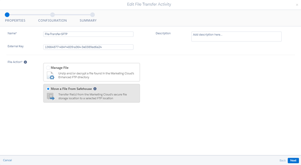

   Finally, in the next window, provide the same File Naming Pattern used during the Data Extract Activity configuration. This ensures that the correct file is being moved to our SFTP location.  
   
   In the Destination, select the name of the File Location that was setup. It should appear in the drop down selection. 

   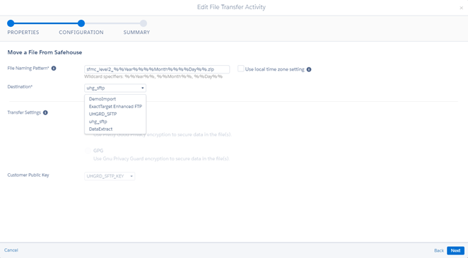

   Overall, below is how it should look like after setting up the automation within Marketing Cloud: 

   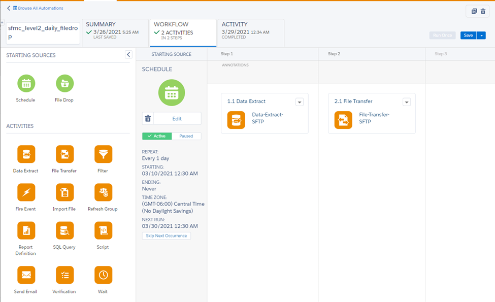
   
   Make sure to name the automation appropriately before clicking Save.  
   
   Click Active under Schedule to make sure the automation runs during the desired schedule.  

   </li>
</ul>

**Note**: A Data Extract Automation needs to be created for each business unit in order to capture their individual Tracking Data. To switch to a different business unit, simply hover in the upper right-hand corner and select a business unit.

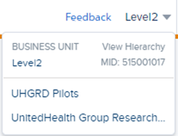

Here are the name of the automations created per business unit:
<ul>
<li>Enterprise Level: <b>sfmc_all_bu_daily_filedrop</b></li>
<li>Level2: <b>sfmc_level2_daily_filedrop</b></li>
<li>OptumLabs Pilot: <b>sfmc_pilots_daily_filedrop</b></li>
</ul>

#### Data Extracts
The Marketing Cloud Data Extract Automation runs daily between 1:00 a.m. to 2:00 a.m. Central Time. It produces three zipped files, one each for Enterprise, Level2 and OptumLabs Pilots business units. Each zipped file is suffixed with the current date. 

The zipped files for both the OptumLabs Pilots (sfmc_pilots_yyyymmdd.zip) and Level2 (sfmc_level2_yyyymmdd.zip) business units contain 19 CSV files. 

On the other hand, the zipped file for the Enterprise level extract (sfmc_all_bu_yyyymmdd.zip) only contains five out of the 19 files since it doesn’t capture data from the rest of the Tracking Extract outputs. 

For a description of each Tracking Extract Output and a comprehensive data dictionary for each item, refer to this link from the official Marketing Cloud documentation: https://help.salesforce.com/articleView?id=sf.mc_as_tracking_extract_output.htm&type=5 

### S3 Bucket to GCP
<ul>
<li>After the zipped files have been dropped to the ECG inbound location, ECG will then transfer the files once detected to <i>aws-bkt-prd-sfmc</i> AWS S3 Bucket.</li>

| ECG Configurations     |                        |
| ---                    | ---                    |
| Configuration Id       | 21MU6                  |
| Source User Id         | es10f80                |
| Source Directory|/in/SalesForceMarketing/urd|
| Destination Host       | AWS Cloud              |
| Destination User Id    | cloud.10000487.aws     |

<li>Each zipped files are picked up from the S3 bucket and loaded to their corresponding folder in ds-00.bkt_sfc_marketing_cloud GCS bucket. 
<li>Each CSV files are loaded to an individual tables in ds-00.salesforce_marketing_cloud_etl with prefix based on the business unit followed by an underscore and the name of the table based on the file name. 
During the next steps, these prefixes are no longer present since these tables will be merged.</li>
<li>The following tables are simply added incrementally to the ODS tables since new records are added daily: <i>bounces, clickimpression, clicks, complaints, conversions, notsent, opens, sendimpression, sendjobimpression, sent, statuschange, surveys, unsubs</i>

For the following, only new records are inserted to the ODS tables: <i>attributes, lists, listmembership, multipledataextensionsendlists, sendjobs, subscribers</i>
</li>
<li>During the ETL to ODS process, a second step is performed to create the MDM Crosswalk. 

- The subscriber_key, which is found in most of the tables, is a unique identifier associated with a person’s record in Marketing Cloud. This ID corresponds to any of the following IDs: AccountID or ContactID from Salesforce Zeus, CandidateID from Salesforce Legacy. In some instances, it can also be a combination of PIMID_emailaddress. 

- Therefore, for the MDM Crosswalk, the subscriber_key is matched to Salesforce Legacy crosswalk to get the savvy_pid and savvy_did. The subscriber_key is also matched to the records in Salesforce Zeus in order to get the PIM ID, and then matched to the pim_mdm_crosswalk to get the savvy_pid and savvy_did. Those subscriber_key with PIMID_emailaddress combination, the PIMID portion is sliced, before matching to the pim_mdm_crosswalk to get the savvy_pid and savvy_did 
</li>
</ul>

### Process Flow Diagram
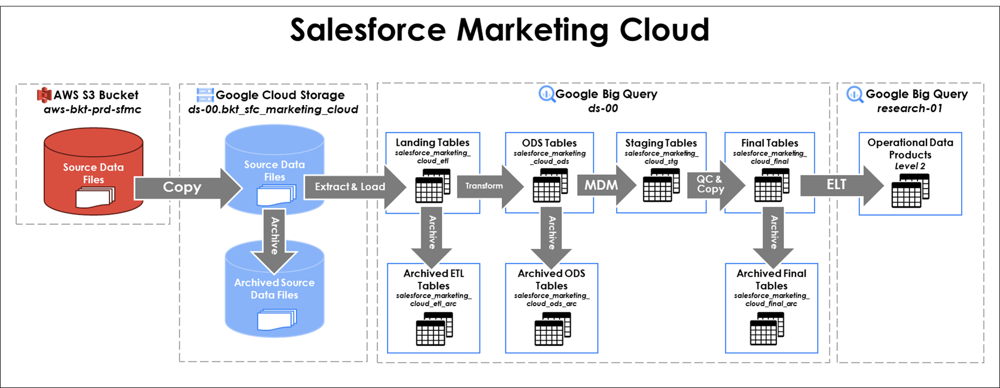

## References
#### Sharepoint
  - [Salesforce Marketing cloud](https://savvysherpa.sharepoint.com/:f:/r/sites/DataEngineering/Data%20Sources/Salesforce%20Marketing%20Cloud?csf=1&web=1&e=gC4cTb)

#### Online Documentation
  - https://help.salesforce.com/articleView?id=sf.mc_as_tracking_extract.htm&type=5