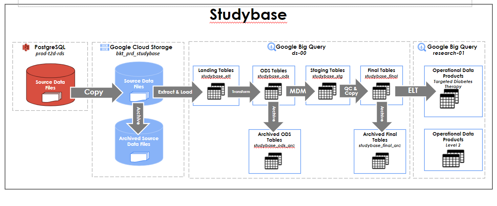

# Studybase
## Table of Contents
1. [Overview](#overview)
2. [Contacts](#contacts)
3. [Program and Background Information](#program-and-background-information)
4. [Data Acquisition](#data-acquisition)
5. [Integration Process](#integration-process)
     - [Process Flow Diagram](#process-flow-diagram)
6. [References](#references)

## Overview
Studybase is a program management application. A tool used to manage the participant's tasks required to complete the study/program. 
This application can contain different programs with unique requirements and its participants. Studybase is also integrated to other applications such as Glucose guide and Salesforce.  

## Contacts
|Resource|Email|Role|
|---|---|---|
|Jared Jones|jaredjones@uhg.com|Data Owner or Consumer|
|Brian Quimod|bquimod@savvysherpa.com|Partner Contact|
|Ashok Kumar|akumar@savvysherpa.com|Partner Contact|
|Edson Paul Semorio|esemorio@savvysherpa.com|PH Data Engineer (Primary)|
|Jefferson Piscos |jpiscos@savvysherpa.com|PH Data Engineer (Secondary)|
|Karan Sapiah |ksapiah@savvysherpa.com |US Data Engineer (Secondary)|

## Program and Background Information
|Details| |
|---|---|
|Is this part of a Pilot?|Yes, it is also used in other applications such as Glucose guide and Salesforce.|
|Is data for UHC Members or general population?|General population (Commercial, Medicare, Medicaid, Pilot cohort, non-UHG)|
|Area of focus if known (EMR, claims, CRM, etc.)?|Member, Device, Study data|
|Is there demographic information?|Yes|

## Data Acquisition
|Details||
|---|---|
|Data: <ul><ul><li>Inbound</li><li> Outbound</li></ul></ul> | Inbound |
|Frequency: <ul><ul><li>One time</li> <li>Recurring (Hourly, Daily, Weekly, Monthly, etc.)</li><li> Custom</li></ul></ul>| Daily |
|Data location: <ul><ul><li>Within UHG</li><li> External partner</li></ul></ul> | Within UHG |
|Data source: <ul><ul><li>Database (Azure, AWS, PostgreSQL, etc.)</li><li> Streaming (Pubsub, Kafka, etc.)</li><li> Files (NGIS, GCS, etc.)</li><li> API | PostgreSQL|

## Integration Process
|Details||
|---|---|
|Dag Name|sudybase_postgre_to_final|
|Schedule|Daily at 12:00:00 UTC |
|Refresh flow|Complete refresh|
|MDM table creation|Yes|
|Checking/ monitoring|Airflow|
|Number of files, expected file size|~2M records|
|Data Transformation|File to table|
|Credentials|<table>
```dbname='t2d',
user='svc_etl_gmp',
password=svc_password,
host='prod-t2d-rds.c1nqtd6s9v6b.us-east-1.rds.amazonaws.com',
port='5432',
sslmode='verify-full',
sslrootcert=ssl_root_cert
```
</table>

<ul>
<li>All data for studybase comes from the studybase schema in the prod-t2d-rds PostgreSQL server.</li>
<li>The job simply pulls all the table into CSV files and immediately uploads the files to a GCS bucket.</li>
<li>CSV files are then loaded into their own table in the corresponding GCP datasets.</li>
</ul>

### Process Flow Diagram


## References
#### Sharepoint
  - [Studybase](https://savvysherpa.sharepoint.com/sites/DataEngineering/Data%20Sources/Studybase)
  